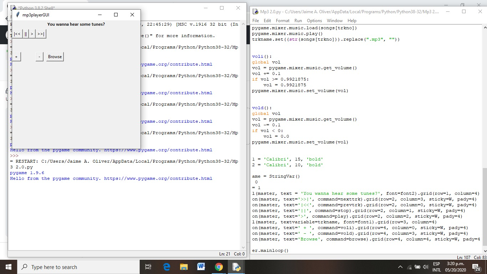
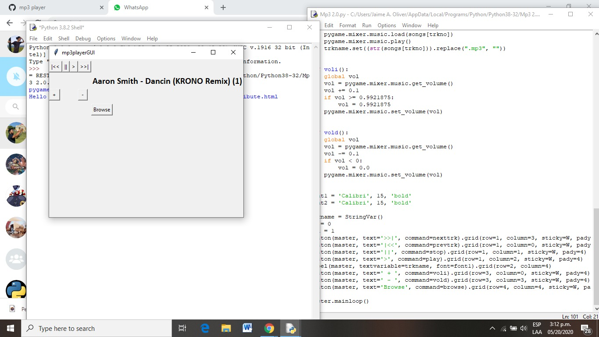

# mp3player "Final Project GUI"
A basic mp3 player project for CECS 3210-21 Advanced Programming SP-20
Polytechnic University of Puerto Rico 
# Details
This is a group project between Jaime Oliver & Alfredo Rosa
## Language Used
Python 3.7
## Dependencies
* Tkinter
* Pygame
* tkFileDialog
* OS module
* NumPy

## Main Features
* mp3 player buttons (play,stop,next track,previous track)
* Volume up and down buttons

## Challenges and Modifications
* Visual improvement and better GUI design
* Previous functions were modified tu run in Python 3
* Able to browse a directory in which songs are kept

## Screenshots
### Shows mp3 player GUI 
 
### Shows song played in mp3 player GUI

